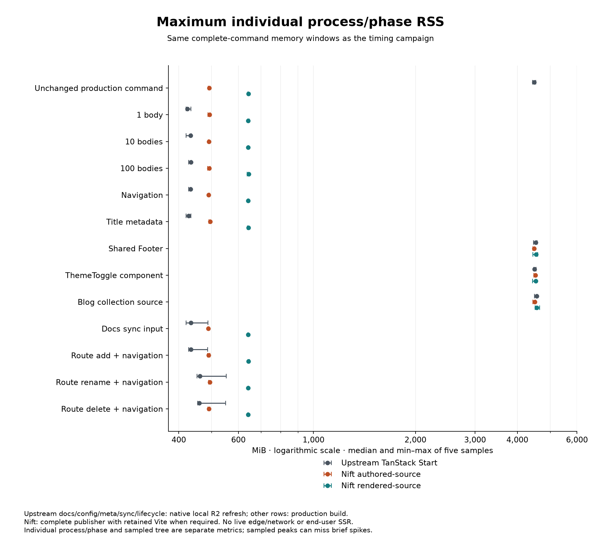
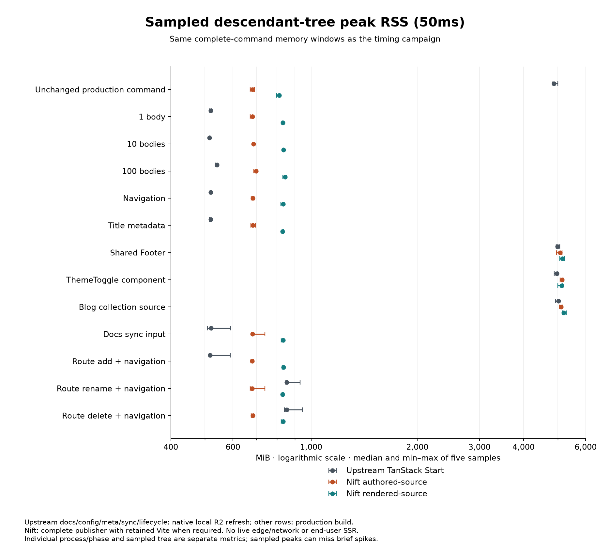

# TanStack.com: faithful intermediate result — T10

This experiment moves documentation input publication into Nift while preserving TanStack Start's request-time application. It does not replace Start, Router, Query, React, the shared shell or backend services. The accepted scope is a pinned, production-scale local migration and evidence campaign; live private service/tenant deployment integration remains unverified.

## Source models and architecture

**Upstream TanStack Start** consumes distributed GitHub documentation through its native R2 cache at request time. **Nift `tanstack` (authored-source)** maintains Markdown/frontmatter and the original repo/ref/path organization. **Nift `tanstack-agent` (rendered-source)** maintains pre-derived TanStack document AST envelopes with explicit original/download text projections where useful, plus the necessary retained React and authored inputs. “Rendered-source” here is a hybrid runtime-consumed representation, not a claim that every page is maintained HTML or every build is Markdown-free.

```text
Nift tanstack:
maintained Markdown/frontmatter + structured inputs
  → original bounded ref/section/image rules
  → transient document AST + raw/download/metadata projections
  → Nift raw composition + asset publication
  → retained TanStack Start request-time rendering/application

Nift tanstack-agent:
maintained document AST + explicit original/download projections
  → Nift raw composition + asset publication
  → retained TanStack Start request-time rendering/application

Both:
retained React/Router/Query/Start/service source
  → required Vite browser/Worker bundling
  → publication/client + publication/server
```

The root creates fresh partner-placement state. A whole-page snapshot prototype froze that behavior despite passing initial byte/hydration checks, so it was rejected before corpus scaling. Marketing and application components remain React source. All API routes, Worker entry and storage/auth/database/AI/workflow implementations remain byte-identical to upstream; 2,794 of 2,799 upstream tracked files are byte-identical, with five bounded content/asset adapter changes and new owned utilities. See [retention ledger](investigation/RETAINED-TANSTACK.md).

## Accepted parity and scope

Pinned site commit: `862ccc3d191818320c3e6d217542883f80cb907a`. Twenty-four external repo/ref pairs cover 25 documentation roots. All 7,601 original inputs are verified; 7,527 nonempty document projections match the original parsed semantics. Two partner-dependent hosting guides remain runtime-owned, 18 MDX inputs preserve upstream's existing selection behavior, and the 80 blog sources retain their original collection workflow.

Within each source model, optimized fresh publication reproduces its own optimized warm **24,648 files byte-for-byte** (this is not cross-model byte equality), including raw/resolved text, document projections, metadata, assets and retained bundles. This is a publication-file count, not a count of HTML pages. All 244 maintained static files (111,985,406 bytes) are preserved.

Post-optimization proof includes 333 browser states across 37 real routes, three viewports and all three implementations; six additional real catalog chart states render and respond to keyboard navigation; hosted-search filters, deduplication and client navigation pass six states. Generated robot/LLM/sitemap bytes and cache headers match in 30 states, local API contracts match in 27 states, and the dynamic OG service returns the same successful PNG. Theme/mobile navigation, Markdown negotiation and fresh partner sessions pass. All corpus/lifecycle/revision/dependency gates pass. Editing a real React source updates five framework projections, while an unrelated Router projection stays byte-identical and literal template-like syntax survives composition.

Each required suite passes TypeScript/lint, 540 unit tests (four skips), 2,269 chat tests and 20 desktop tests (one skip). These local Chromium/UI, source-preservation and real local R2 checks do not certify live PostgreSQL, OAuth, AI, mail, upload, hosted-index freshness/ranking, tenant deployment or other browsers. See [T9 validation](evidence/t9/validation-summary.json).

## Complete production publication

Seconds: median of five serialized samples, with minimum–maximum in parentheses.

| Workload | Upstream TanStack Start | Nift authored | Nift rendered |
| --- | ---: | ---: | ---: |
| full | 31.22 (28.73–36.26) | 32.42 (32.12–36.31) | 28.95 (28.72–30.42) |
| fresh | 24.31 (24.16–24.50) | 33.09 (32.72–34.87) | 32.45 (29.14–32.58) |
| unchanged | 32.11 (31.00–33.93) | 7.04 (6.76–7.85) | 6.21 (5.66–6.57) |

Full forces retained Vite bundling and all required Nift derivation/composition. Fresh clears defined owned application/output caches; dependencies and OS page cache remain present. Upstream cache reset is preparation outside its timed build; Nift --fresh performs its reset inside the timed command. This conservative reset-overhead difference is explicit, rather than an identical cache-cleanup-window claim. Unchanged runs each normal production command. Nift's reuse of an unchanged retained bundle is orchestration behavior and can also be investigated upstream. These are production CLI workflows, not dev/HMR measurements. Bare Nift composition is only one component and is not native `@markup` performance.

## Changed-input workflows

| Workload | Upstream TanStack Start | Nift authored | Nift rendered |
| --- | ---: | ---: | ---: |
| body-1 | 2.10 (1.98–2.18) | 6.48 (6.11–9.24) | 5.69 (5.43–5.96) |
| body-10 | 2.41 (2.34–2.84) | 7.68 (6.90–7.70) | 6.51 (6.03–7.21) |
| body-100 | 4.29 (4.08–4.49) | 7.36 (6.74–7.77) | 6.41 (6.23–6.73) |
| navigation | 2.11 (2.03–2.15) | 6.98 (5.16–7.65) | 5.20 (4.75–5.38) |
| metadata | 1.70 (1.63–1.78) | 6.01 (5.90–7.73) | 7.40 (7.02–8.26) |
| shared-shell | 36.48 (30.76–40.51) | 39.72 (34.44–43.77) | 41.52 (34.05–52.76) |
| island | 32.63 (29.80–33.68) | 38.09 (32.66–40.57) | 27.91 (27.68–28.15) |
| collection | 24.03 (23.88–24.91) | 28.20 (28.01–28.71) | 27.96 (27.85–28.24) |
| docs-sync | 1.28 (1.24–1.29) | 4.24 (4.21–4.28) | 4.01 (3.96–4.01) |
| route-add | 1.29 (1.24–1.29) | 4.24 (4.15–4.33) | 4.01 (3.94–4.20) |
| route-rename | 8.72 (8.42–9.00) | 4.22 (4.15–4.26) | 4.03 (3.99–4.07) |
| route-delete | 8.60 (8.56–8.90) | 4.23 (4.21–4.57) | 4.43 (4.20–4.64) |

Body/config/title/docs-sync/lifecycle upstream cases use the original **native local R2 cache/ingestion workflow**, not Vite. Ordinary valid paths refresh the lighter path manifest. Rename/delete also prepare the full original redirect manifest used by missing-path resolution. The benchmark helper is compiled against unchanged pinned private helpers exposed by a build-only visibility shim. Its complete command includes startup, invalidation, changed-input reads, appropriate artifact refresh and disposal. It uses captured public GETs and the same marker-checked 100 real React authored inputs as the edit driver, with a primed Query working set; live network/edge purge and end-user SSR are outside this scope.

Nift rows measure the complete production publisher and whatever retained bundle work is required. Footer/shared-shell, ThemeToggle island and authored blog edits trigger production Vite bundling in all implementations. Agent source maintenance coordinates the selected page packets' AST/raw/download fields explicitly before timing. An authored/native primary body input has five framework dependencies; the rendered fixture edits the corresponding maintained page packet independently, without timing or claiming automatic propagation to every sibling projection. Publication byte fan-out is retained. These are source-model-specific edit semantics, not identical authored dependency edits. Lifecycle cases use an independent Comparison source without incoming refs and update its actual navigation entries; rename removes the old canonical path without adding an alias. Docs-sync updates a controlled content input and digest registry; public acquisition is outside timing. Raw records retain scopes, phases, machine load and publication byte fan-out. See [protocol](investigation/T10-PROTOCOL.md) and [raw samples](evidence/t10/samples.json). Do not pool native-refresh and production-rebuild rows. These have different readiness contracts: upstream stops at refreshed runtime inputs/cache artifacts and retains AST/page rendering at request time; Nift also pre-derives the affected runtime document projections. Neither row includes an end-user request. This is not evidence that one request-serving implementation is faster.

## Component costs

Median seconds from the same five complete-publisher samples:

| Case / model | Vite | Assets | Compatibility | AST derivation | Preparation | Nift | Whole command |
| --- | ---: | ---: | ---: | ---: | ---: | ---: | ---: |
| full / authored | 24.67 | 0.13 | 1.60 | 2.53 | 1.13 | 0.77 | 32.42 |
| full / rendered | 24.38 | 0.13 | — | — | 2.09 | 0.82 | 28.95 |
| fresh / authored | 24.64 | 0.10 | 1.71 | 2.64 | 1.22 | 0.75 | 33.09 |
| fresh / rendered | 26.96 | 0.11 | — | — | 2.36 | 0.84 | 32.45 |
| unchanged / authored | 0.00 | 0.18 | 1.72 | 0.47 | 1.67 | 0.27 | 7.04 |
| unchanged / rendered | 0.00 | 0.18 | — | — | 2.90 | 0.29 | 6.21 |
| body-1 / authored | 0.00 | 0.17 | 1.52 | 0.43 | 1.56 | 0.39 | 6.48 |
| body-1 / rendered | 0.00 | 0.17 | — | — | 2.72 | 0.41 | 5.69 |
| body-100 / authored | 0.00 | 0.18 | 1.80 | 0.67 | 1.51 | 0.44 | 7.36 |
| body-100 / rendered | 0.00 | 0.18 | — | — | 2.98 | 0.46 | 6.41 |
| shared-shell / authored | 34.17 | 0.16 | 1.29 | 0.37 | 1.34 | 0.25 | 39.72 |
| shared-shell / rendered | 36.66 | 0.16 | — | — | 2.48 | 0.26 | 41.52 |

Zero Vite time means the unchanged bundle was reused. The rendered corpus has no Markdown-to-document derivation stage; retained blog derivation remains inside Vite when required. Preparation includes inventory/payload/frontmatter/tree/metadata work. Child startup is included in its instrumented stage; parent process startup, fingerprinting, cleanup and revision configuration remain in whole-command time. Parent content totals and their child phases overlap; do not sum both. [All component costs](evidence/t10/component-summary.json) also retain the upstream helper's internal native refresh time separately from its complete startup/disposal command.

Median publication byte fan-out (outside timing):

| Case / model | Added files | Deleted files | Byte-changed files |
| --- | ---: | ---: | ---: |
| body-1 / authored | 0 | 0 | 13 |
| body-1 / rendered | 0 | 0 | 5 |
| body-10 / authored | 0 | 0 | 82 |
| body-10 / rendered | 0 | 0 | 32 |
| body-100 / authored | 0 | 0 | 564 |
| body-100 / rendered | 0 | 0 | 302 |
| route-add / authored | 3 | 0 | 6 |
| route-add / rendered | 3 | 0 | 6 |
| route-rename / authored | 3 | 3 | 6 |
| route-rename / rendered | 3 | 3 | 6 |
| route-delete / authored | 0 | 3 | 6 |
| route-delete / rendered | 0 | 3 | 6 |

Each lifecycle sample starts from restored original publication/cache state; every add/rename creates the three owned document outputs and every rename/delete removes the old three. The rendered source model's independently maintained page edits have different dependency semantics; source-maintenance coordination is outside the build timer.

## Memory

Maximum individual process/phase RSS, MiB: median of five, with ranges. This is not summed pipeline memory.

| Workload | Upstream TanStack Start | Nift authored | Nift rendered |
| --- | ---: | ---: | ---: |
| full | 4539.60 (4455.01–4602.98) | 4555.08 (4522.40–4593.69) | 4535.62 (4452.32–4605.22) |
| fresh | 4555.43 (4508.06–4588.08) | 4495.41 (4447.34–4583.12) | 4468.56 (4398.11–4518.13) |
| unchanged | 4486.23 (4433.65–4533.47) | 492.39 (488.91–494.22) | 641.71 (639.80–642.68) |

The separate 50ms sampled descendant-tree RSS covers the same complete command windows and excludes unrelated processes. It can miss short peaks and must not be substituted for the individual-process metric.

| Workload | Upstream TanStack Start | Nift authored | Nift rendered |
| --- | ---: | ---: | ---: |
| full | 5009.29 (4910.05–5079.66) | 5170.09 (5155.20–5211.62) | 5130.93 (5109.59–5196.87) |
| fresh | 5031.03 (4917.46–5071.88) | 5136.04 (5058.39–5203.14) | 5058.39 (4990.19–5132.73) |
| unchanged | 4881.30 (4843.03–5007.77) | 681.36 (671.85–689.84) | 812.05 (798.79–813.95) |





Retained Vite/Start leaves warm-full individual process/phase RSS near 4.4 GiB in all three implementations; this architecture does not materially reduce that cost. On one-body input updates, upstream measures 424.1 MiB, authored Nift 492.8 MiB and rendered Nift 641.4 MiB. Skipping unchanged bundling lowers Nift unchanged-command RSS, but the rendered source model does not win every memory row. Each graph displays median and min–max from the same five command windows as its timing row. Native-refresh and production-build scopes remain distinct.

| Workload | Upstream TanStack Start | Nift authored | Nift rendered |
| --- | ---: | ---: | ---: |
| unchanged | 4486.23 (4433.65–4533.47) | 492.39 (488.91–494.22) | 641.71 (639.80–642.68) |
| body-1 | 424.13 (420.04–434.52) | 492.82 (487.85–495.76) | 641.43 (639.59–645.49) |
| body-10 | 433.85 (420.22–435.02) | 490.42 (488.36–492.50) | 641.67 (640.38–642.81) |
| body-100 | 434.32 (427.74–435.07) | 491.62 (486.91–495.14) | 643.20 (637.09–643.88) |
| navigation | 433.83 (427.52–434.82) | 490.02 (488.85–493.45) | 641.02 (640.29–644.31) |
| metadata | 427.85 (420.33–434.74) | 494.74 (491.33–495.76) | 642.07 (638.15–643.54) |
| shared-shell | 4536.52 (4464.01–4570.76) | 4482.37 (4443.65–4505.10) | 4545.83 (4445.34–4590.56) |
| island | 4492.04 (4478.24–4538.97) | 4521.76 (4477.77–4546.30) | 4534.43 (4434.20–4541.91) |
| collection | 4567.58 (4490.81–4573.75) | 4501.14 (4443.73–4525.47) | 4563.87 (4509.98–4654.54) |
| docs-sync | 434.23 (420.34–487.49) | 488.86 (487.59–491.37) | 641.35 (639.39–641.75) |
| route-add | 434.01 (427.78–487.18) | 490.21 (486.55–494.24) | 641.83 (641.11–646.33) |
| route-rename | 461.36 (452.41–552.11) | 493.97 (490.03–494.15) | 641.37 (640.43–643.05) |
| route-delete | 459.30 (454.76–549.86) | 491.27 (488.06–494.11) | 640.88 (640.23–642.22) |

Incremental sampled descendant-tree RSS, MiB:

| Workload | Upstream TanStack Start | Nift authored | Nift rendered |
| --- | ---: | ---: | ---: |
| unchanged | 4881.30 (4843.03–5007.77) | 681.36 (671.85–689.84) | 812.05 (798.79–813.95) |
| body-1 | 518.99 (515.82–520.96) | 681.43 (672.33–683.68) | 831.57 (827.56–832.09) |
| body-10 | 514.65 (514.28–516.38) | 686.62 (682.62–690.21) | 833.81 (832.82–835.21) |
| body-100 | 540.62 (535.78–542.05) | 697.86 (687.71–701.85) | 842.73 (831.65–844.13) |
| navigation | 518.96 (516.42–521.07) | 683.13 (675.34–689.81) | 832.10 (819.74–836.33) |
| metadata | 518.65 (514.56–520.64) | 682.80 (674.67–695.12) | 830.00 (826.91–835.46) |
| shared-shell | 4994.37 (4948.28–5072.60) | 5079.07 (4963.61–5139.45) | 5152.80 (5071.22–5238.82) |
| island | 4975.66 (4888.32–5005.54) | 5140.06 (5079.92–5172.59) | 5138.20 (5004.44–5164.41) |
| collection | 5027.23 (4925.83–5059.03) | 5110.96 (5063.14–5160.19) | 5194.43 (5158.61–5290.59) |
| docs-sync | 520.51 (508.66–590.80) | 682.16 (677.57–739.19) | 833.09 (822.71–834.49) |
| route-add | 517.20 (513.89–589.38) | 679.89 (674.90–686.58) | 834.70 (828.05–838.41) |
| route-rename | 851.88 (847.78–930.55) | 680.27 (671.38–739.59) | 830.07 (828.80–836.14) |
| route-delete | 852.20 (839.76–943.91) | 682.91 (676.30–687.25) | 833.11 (821.84–836.18) |

## Initial evidence and optimization

Initial three-sample medians were full 30.85s upstream, 44.17s authored and 36.88s rendered; unchanged 31.31s, 16.67s and 7.55s. The earlier force-command cohort is retained as rejected evidence because it forced Vite but omitted Nift --all. Corrected rows replace it, without pooling. An eager redirect-metadata refresh smoke is diagnostic, not an ordinary body-edit result; final native cases follow the actual valid/missing-path branches.

Profiles identified unused excerpt parsing, thousands of dynamic metadata imports and corpus-wide repeated work. The optimized producer reuses existing metadata parsers/normalizers, records actual transitive read dependencies, caches authored resolution/derivation by source and implementation hashes, and bypasses those caches on forced full. Runtime manifest reuse requires a verified immutable publication revision written into Worker vars; missing revision stays uncached. Fresh output equivalence and all parity gates were revalidated. No Nift core changes were made. See [initial evidence](evidence/t8/accepted-summary.json), [optimization](investigation/T9-OPTIMIZATION.md) and [component costs](evidence/t10/component-summary.json).

Hosted Algolia search remains the original external service. Its client bundling is included; neither upstream nor migration has a local index-generation stage. Dynamic OG remains a retained request-time service. Server-rendered sitemap/LLM output and backend infrastructure are distinguished from publication/build work.

## Engineering assessment

**Agents implement, humans direct: preferred — Upstream TanStack Start for this site.** Its Markdown and native distributed GitHub/R2 ingestion are already a coherent source-of-truth model, and its measured ordinary docs-input refresh is lighter than either complete Nift publisher. Those different readiness contracts do not establish request-serving superiority; the preference also weighs the simpler retained source/ingestion ownership. The Nift boundary is faithful and useful when an explicit, revisioned offline corpus publication is a requirement; the measurements do not establish that this site needs the additional stages and adapters for routine maintenance.

**Humans and agents both edit: preferred — Upstream TanStack Start.** Preserve authored Markdown, structured menus and useful React/TanStack code. Among the two Nift alternatives, prefer **Nift `tanstack` (authored-source)** in both maintenance scenarios: one authored corpus derives AST/raw/download metadata, while **Nift `tanstack-agent` (rendered-source)** requires coordinated AST/original/download edits. The rendered model's cheaper forced publication does not automatically outweigh that source coordination or its larger serialized representation.

**Counterfactual:** removing migration effort and incumbency does not change those preferences. This judgement rests on the retained native ingestion model, ordinary edit costs and representation/ownership complexity, not simply the cost of getting to a new stack. An organization requiring a frozen, atomic, pre-derived docs publication could reasonably choose the Nift authored boundary for that different requirement.

**Official evaluation:** the experiment justifies a scoped evaluation of moving selected documentation publication, metadata or offline artifact responsibilities into Nift **while retaining TanStack Start, React, Router, Query and backend services**. It does not establish that tanstack.com should replace Start or move its full docs workflow. Profile narrower invalidation and payload/cold-runtime costs before making that decision. Nift + retained TanStack is more faithful than forcing this application into framework-free static output; it is not demonstrated better than the incumbent native stack overall.

## Reproduction and closeout

Complete commands, fixture provisioning and cache definitions are in the [README](README.md), [reproduction](investigation/REPRODUCTION.md) and protocol. Dependencies/input acquisition are outside timing. The campaign spans 9–10 October 2026 in Australia/Melbourne with fixed serialized implementation order and preserved resumable cohorts. It is not randomized or guaranteed contemporaneous across implementations; close full-build gaps and overlapping ranges are not decisive. The machine has unrelated user work; it was neither stopped nor included in descendant memory, and per-sample load/ranges are retained. No exclusive-machine or OS-cold claim is made. Source mutations are reversible and journaled outside the repositories. Final source/publication restoration, fresh-clone build/corpus verification, repository synchronization and local/public evidence-link checks are recorded in [closeout](evidence/t10/closeout.json).

Future candidates belong in [FUTURE-WORK.md](investigation/FUTURE-WORK.md); concrete init-guidance proposals are in [MIGRATION-INIT-REVIEW.md](investigation/MIGRATION-INIT-REVIEW.md). This experiment does not authorize additional core changes or a Labs publication.


This checkpoint is preserved before the authorized additional performance pass. Its engineering judgement is provisional; it is not the final experiment closeout.
